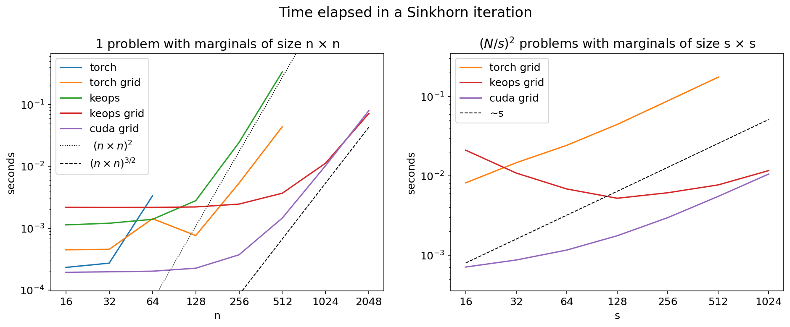

# LogSinkhornGPU

LogSinkhorn routines using the GPU. 

This package aims to provide fast, stable and flexible implementations of the LogSinkhorn algorithm in the GPU. The main features are: 

* We support **batched** problems, this is, solving simultaneously several problems that share the same cost.

* We provide **several backends** for the most resource-intensive part of LogSinkhorn, i.e. the softmin or LogSumExp. The different backends are `torch`, `keops` (which has linear memory footprint) and a dedicated `cuda` implementation (also with linear memory footprint). 

* We provide **separable implementations** with lower complexity for problems supported on a 2D or 3D grid with the square cost.

* Our library is **extendable**: it makes it easy to write solvers for other transport problems that can be solved with algorithms of the Sinkhorn family.

## The standard problem 

This package is designed to solve the regularized optimal transport problem

$$ \min_{\pi \in \Pi(\mu, \nu)} \langle c, \pi \rangle + \varepsilon \text{KL}(\pi | \hat{\mu}\otimes \hat{\nu})$$

This problem can be solved with the Sinkhorn algorithm. The solution takes the form of a diagonal scaling, i.e.

$$\pi_{ij} = \exp\left( \frac{\alpha_i + \beta_j - c_{ij}}{\varepsilon} \right) \hat{\mu}_i\, \hat{\nu}_j $$

where the *dual potentials* $\alpha$ and $\beta$ satisfy the relations

$$
\alpha_i = - \varepsilon
\left[
\log
\left(
\sum_j
\exp\left(
\frac{
\beta_j - c_{ij}
}{\varepsilon}
\right)
\hat{\nu}_j
\right)
+
\log\frac{\hat{\mu}_i}{\mu_i}
\right]
$$

$$
\beta_j = - \varepsilon
\left[
\log
\left(
\sum_i
\exp
\left(
\frac{
\alpha_i - c_{ij}
}{\varepsilon}
\right)
\hat{\mu}_i
\right)
+
\log\frac{\hat{\nu}_j}{\nu_j}
\right]
$$

This relations can be used to build a fixed-point algorithm, the Sinkhorn algorithm.

## Batched problems 

All the inputs are assumed to have shapes of the form (B, M) (or (B, M1, ..., Md) for the separable version). The first dimension is the batch dimension: several problems can thus be concatenated and solved in parallel in the GPU. 

## Several backends

In our experience solving optimal transport problems in different regimes, not all solvers perform the best for all problem sizes. CPU solvers work very well when one has many heterogeneous problems of small size (and several cores to solve them in parallel); this is the case, for example, in the domain decomposition algorithm for optimal transport. On the other hand, GPU solvers such as `geomloss` work specially well for big problems. 

A comparison of the performance for one problem and many small problems is given below. The objective in providing this comparison is that users can choose what solver is best suited for their needs. In summary: 

## Separable implementations

For the square cost on a grid there is a simple trick that reduces the complexity of the Sinkhorn iteration. This is explained in Remark 4.17 of *Computational Optimal Transport* by Peyre and Cuturi for the standard Sinkhorn, and we cover it here for the log-domain version. 

For input measures $\mu$ and $\nu$ and dual potentials $\alpha$ and $\beta$, the log-sinkhorn half-iteration reads: 

$$ \alpha_i =  - \varepsilon \log \sum_j \exp\left( h_j - \frac{|X_i - Y_j|^2_2}{\varepsilon}\right)$$

where $h_j := \nu_j + \beta_j / \varepsilon$ (obtaining $\beta$ from $\alpha$ is analogous). Since the data lives on respective rectangular grids of size $(M_1, M_2)$ and $(N_1, N_2)$, we can decompose the index $i$ into a pair of indices $i_1, i_2$, and analogously for $j$. Then, $X_{i_1, i_2} = (x_{i_1}, x_{i_2})$, and analogously for $Y$. With this indexing the iteration reads: 

$$ \alpha_{i_1, i_2} =  - \varepsilon \log \sum_{j_1, j_2} \exp\left( h_{j_1, j_2} - \frac{(x_{i_1} - y_{j_1})^2 + (x_{i_2} - y_{j_2})^2}{\varepsilon}\right)$$

Thus, the original logsumexp (with complexity in $O(M_1 M_2 N_1 N_2)$) can be replaced by a first logsumexp (with complexity in $O(M_2N_1N_2)$)

$$ \tilde{\alpha}_{j_1, i_2} := \log \sum_{j_2}\exp\left( h_{j_1, j_2} - \frac{(x_{i_2} - y_{j_2})^2}{\varepsilon}\right) $$

followed by a second logsumexp (with complexity in $O(M_1M_2N_1)$):

$$ \alpha_{i_1, i_2} =  - \varepsilon \log 
\sum_{j_1} \exp\left(\tilde{\alpha}_{j_1, i_2}  - \frac{(x_{i_1} - y_{j_1})^2}{\varepsilon}\right)
$$

## Extendable classes

We provide the base class `AbstractSinkhorn`, from which all the rest of solvers derive. Users can define new Sinkhorn solvers by following the structure of the specific solver that works best for their problem. An example is given in the `examples` folder. 